# Respostas do Projeto 1 de POO

## 1 – Tema do Projeto

O tema do Projeto 1 é o desenvolvimento de um sistema para gerenciamento de um restaurante fast-food. O sistema abrange funcionalidades como cadastro de clientes, realização de pedidos, gerenciamento de produtos (alimentos, bebidas, combos), controle de caixa, restrições alimentares, acompanhamento do status dos pedidos, entre outros. O objetivo é simular o funcionamento de um restaurante, desde o atendimento ao cliente até a entrega do pedido, utilizando conceitos fundamentais de Programação Orientada a Objetos (POO).

## 2 – Inserção dos Conceitos de POO

- **Classes:**
  - O projeto é estruturado em torno de classes que representam entidades do domínio, como `Cliente`, `Pedido`, `Produto`, `Alimento`, `Bebida`, `Combo`, `Caixa`, `Restaurante`, `RestricaoAlimentar`, entre outras. Cada classe encapsula atributos e métodos relacionados à sua responsabilidade.

- **Herança:**
  - O conceito de herança é utilizado, por exemplo, nas classes `Alimento` e `Bebida`, que herdam de uma classe base `Produto`. Isso permite o reuso de atributos e métodos comuns, além de especializar comportamentos para cada tipo de produto.

- **Polimorfismo:**
  - O polimorfismo é aplicado ao permitir que métodos como `calcular_preco()` sejam implementados de formas diferentes em subclasses como `Alimento`, `Bebida` e `Combo`, mas possam ser chamados de maneira uniforme a partir de uma referência do tipo `Produto`.

- **Classes Abstratas:**
  - O projeto pode utilizar classes abstratas para definir interfaces comuns, como uma classe abstrata `Produto` que define métodos obrigatórios para suas subclasses, garantindo que todas implementem comportamentos essenciais.

## 3 – Fluxograma Generalista

### 3.1 - Fluxo Principal do Cliente

```mermaid
flowchart TD
    A[🏠 Página Inicial] --> B{Cliente Autenticado?}
    
    B -->|Não| C[👤 Tela de Login/Cadastro]
    B -->|Sim| D[🍽️ Cardápio Principal]
    
    C --> C1[📝 Formulário de Login]
    C --> C2[➕ Criar Conta Temporária]
    C --> C3[🔐 Criar Conta Permanente]
    
    C1 --> C1a{Login Válido?}
    C1a -->|Não| C1b[❌ Mostrar Erro]
    C1b --> C1
    C1a -->|Sim| D
    
    C2 --> C2a[✅ Cliente Temporário Criado]
    C2a --> D
    
    C3 --> C3a[✅ Cliente Permanente Criado]
    C3a --> D
    
    D --> E[🔍 Navegar Produtos]
    E --> F[➕ Adicionar ao Carrinho]
    F --> G{Continuar Comprando?}
    
    G -->|Sim| E
    G -->|Não| H[🛒 Visualizar Carrinho]
    
    H --> I[🏪 Checkout]
    I --> J[📍 Escolher Endereço/Entrega]
    J --> K[💳 Método de Pagamento]
    K --> L[📋 Resumo do Pedido]
    L --> M[✅ Finalizar Pedido]
    
    M --> N[📊 Status do Pedido]
    N --> O{Pedido Concluído?}
    
    O -->|Não| P[⏳ Aguardar Atualização]
    P --> N
    O -->|Sim| Q[🎉 Pedido Entregue]
    
    Q --> R{Nova Compra?}
    R -->|Sim| D
    R -->|Não| S[👋 Logout/Sair]
```



### 3.2 - Fluxo de Estados do Pedido


### 3.3 - Fluxo de Componentes React


### 3.4 - Arquitetura de Comunicação Frontend-Backend

```mermaid
sequenceDiagram
    participant U as 👤 Usuário
    participant R as ⚛️ React Component
    participant A as 🔗 API Service
    participant D as 🐍 Django View
    participant DB as 🗄️ Database
    
    U->>R: Clica "Adicionar ao Carrinho"
    R->>A: adicionarProduto(produto, quantidade)
    A->>D: POST /pedido/adicionar-item/
    D->>DB: Criar/Atualizar ItemPedido
    DB-->>D: ItemPedido salvo
    D-->>A: JSON Response
    A-->>R: Dados atualizados
    R-->>U: Carrinho atualizado
    
    Note over R,D: Token CSRF em todas as requisições
    Note over D,DB: Validações de negócio no Django
```



### 3.5 - Mapeamento de URLs e Componentes

| Rota Django | Componente React | Funcionalidade |
|-------------|------------------|----------------|
| `/` | ProdutoApp.jsx | Cardápio principal |
| `/cliente/login/` | LoginApp.jsx | Autenticação |
| `/cliente/register/` | RegisterApp.jsx | Cadastro |
| `/pedido/checkout/` | CheckoutApp.jsx | Finalização |
| `/pedido/{id}/status/` | StatusApp.jsx | Acompanhamento |
| `/pedido/historico/` | HistoricoApp.jsx | Histórico |

Esta arquitetura de fluxo demonstra a integração completa entre Django (backend) e React (frontend), mostrando como o usuário navega pelo sistema desde a autenticação até a finalização do pedido, com estados bem definidos e comunicação eficiente entre as camadas.

## 4 – Modularização e Organização do Código

### 4.1 - Arquitetura Django por Apps

O projeto segue a **arquitetura modular do Django**, organizando funcionalidades em apps independentes e especializados. Esta abordagem promove **separação de responsabilidades**, **reutilização de código** e **facilidade de manutenção**.

#### 4.1.1 - Estrutura de Apps Django

```
apps/
├── core/                    # Funcionalidades base e compartilhadas
│   ├── models.py           # TimeStampedModel, BaseService
│   └── __init__.py
├── cliente/                # Gestão de clientes e autenticação
│   ├── models.py           # Cliente, perfis e autenticação
│   ├── views.py            # APIs e views de cliente
│   ├── services/           # ClienteService para lógica de negócio
│   ├── templates/          # Templates de interface
│   └── migrations/         # Migrações do banco
├── produto/                # Catálogo de produtos
│   ├── models.py           # Produto, Alimento, Bebida, Combo
│   ├── views.py            # APIs de produtos e cardápio
│   ├── services/           # Lógica de negócio dos produtos
│   └── utils/              # Utilitários específicos
├── pedido/                 # Sistema de pedidos
│   ├── models.py           # Pedido, ItemPedido, StatusPedido
│   ├── views.py            # APIs de pedidos e checkout
│   ├── services/           # PedidoService com regras de negócio
│   └── templates/          # Templates de checkout e status
├── restaurante/            # Operações do restaurante
│   ├── models.py           # Restaurante, Caixa, Cozinha
│   ├── views.py            # Dashboard e controle operacional
│   └── templates/          # Interface administrativa
└── shared/                 # Recursos compartilhados
    └── static/             # Assets CSS/JS globais
```

### 4.2 - Implementação das Classes POO

#### 4.2.1 - Classes Efetivas vs Protótipos

**Pasta `Classes/` (Protótipos Iniciais):**
A pasta `Classes/` contém os **protótipos iniciais** das classes, desenvolvidos durante a fase de modelagem conceitual. Estes arquivos servem como **documentação do design inicial** e **referência histórica** do processo de desenvolvimento, mas **não são utilizados na aplicação final**.

**Exemplo de classe prototípica:**
```python
# Classes/Cliente.py (PROTÓTIPO - não utilizado)
class Cliente:
    def __init__(self, name: str, balance: float = 0.0):
        self.name = name
        self.balance = balance
        self.alimentary_restrictions: list[RestricaoAlimentar] = []
```

#### 4.2.2 - Classes Implementadas (Django Models)

As **classes efetivamente utilizadas** estão implementadas como **Django Models** dentro de cada app, seguindo o padrão **Model-View-Controller** do framework:

**Implementação real no sistema:**
```python
# apps/cliente/models.py (IMPLEMENTAÇÃO REAL)
class Cliente(TimeStampedModel):
    """Representa um cliente do restaurante."""
    
    cpf = models.CharField(max_length=14, unique=True, verbose_name="CPF")
    name = models.CharField(max_length=100, verbose_name="Nome")
    phone = models.CharField(max_length=20, verbose_name="Telefone")
    email = models.EmailField(blank=True, null=True, verbose_name="Email")
    
    # Integração com sistema de autenticação
    is_temporary = models.BooleanField(default=True, verbose_name="Conta Temporária")
    password = models.CharField(max_length=128, blank=True, null=True)
    
    # Campos com validação e relacionamentos
    balance = models.DecimalField(max_digits=10, decimal_places=2, default=0.0)
    is_active = models.BooleanField(default=True, verbose_name="Ativo")
    
    def set_password(self, raw_password):
        """Criptografa e armazena a senha."""
        self.password = make_password(raw_password)
    
    def check_password(self, raw_password):
        """Verifica se a senha está correta."""
        return check_password(raw_password, self.password)
```

### 4.3 - Hierarquia de Classes e Herança

#### 4.3.1 - Classe Base Abstrata

```python
# apps/core/models.py
class TimeStampedModel(models.Model):
    """Model abstrato para adicionar timestamps a todas as entidades."""
    created_at = models.DateTimeField(auto_now_add=True)
    updated_at = models.DateTimeField(auto_now=True)
    
    class Meta:
        abstract = True  # Não cria tabela própria
```

#### 4.3.2 - Hierarquia de Produtos

```python
# apps/produto/models.py
class Produto(TimeStampedModel):  # Herança da classe base
    """Classe base para todos os produtos."""
    name = models.CharField(max_length=100)
    price = models.DecimalField(max_digits=10, decimal_places=2)
    available = models.BooleanField(default=True)
    
    def apply_discount(self, discount: float):
        """Polimorfismo - método base para desconto."""
        self.price *= (Decimal('1.0') - Decimal(str(discount)))

class Alimento(Produto):  # Herança especializada
    """Produtos alimentícios com restrições."""
    restricoes_alimentares = models.ManyToManyField('RestricaoAlimentar')
    expiration_date = models.DateField()
    
    def is_expired(self):
        """Método específico para alimentos."""
        return date.today() > self.expiration_date

class Bebida(Alimento):  # Herança múltipla
    """Bebidas com características específicas."""
    volume_ml = models.PositiveIntegerField()
    is_alcoholic = models.BooleanField(default=False)
    temperature = models.CharField(max_length=20)

class Combo(Produto):  # Herança paralela
    """Combos com múltiplos produtos."""
    produtos = models.ManyToManyField(Produto, through='ComboItem')
    
    def calculate_total_price(self):
        """Polimorfismo - cálculo específico para combos."""
        return sum(item.produto.price * item.quantity for item in self.comboitem_set.all())
```

### 4.4 - Padrões de Design Implementados

#### 4.4.1 - Service Layer Pattern

```python
# apps/cliente/services/cliente_service.py
class ClienteService(BaseService):
    """Service para lógica de negócio de clientes."""
    
    @staticmethod
    def create_temporary_client(nome, telefone):
        """Factory method para clientes temporários."""
        cpf = ClienteService._generate_temporary_cpf()
        return Cliente.objects.create(
            cpf=cpf, name=nome, phone=telefone, is_temporary=True
        )
    
    @staticmethod
    def authenticate_client(cpf, password):
        """Strategy pattern para autenticação."""
        try:
            cliente = Cliente.objects.get(cpf=cpf)
            if cliente.check_password(password):
                return cliente
        except Cliente.DoesNotExist:
            return None
```

#### 4.4.2 - Repository Pattern

```python
# apps/pedido/services/pedido_service.py
class PedidoService(BaseService):
    """Service para gerenciamento de pedidos."""
    
    @staticmethod
    def criar_pedido(cliente, observacoes=""):
        """Factory method para criação de pedidos."""
        return Pedido.objects.create(
            cliente=cliente,
            observacoes=observacoes,
            status=StatusPedido.ORDERING
        )
    
    @staticmethod
    def adicionar_item(pedido, produto, quantidade):
        """Strategy para adição de itens com validação."""
        if not produto.available:
            raise ValueError("Produto indisponível")
        
        item, created = ItemPedido.objects.get_or_create(
            pedido=pedido, produto=produto,
            defaults={'quantidade': quantidade}
        )
        if not created:
            item.quantidade += quantidade
            item.save()
```

### 4.5 - Vantagens da Arquitetura Modular

1. **Separação de Responsabilidades**: Cada app cuida de uma funcionalidade específica
2. **Reutilização**: Componentes podem ser reutilizados entre apps
3. **Testabilidade**: Testes isolados por funcionalidade
4. **Escalabilidade**: Fácil adição de novos apps e funcionalidades
5. **Manutenção**: Mudanças localizadas não afetam outros módulos
6. **Desenvolvimento Paralelo**: Equipes podem trabalhar em apps diferentes simultaneamente

### 4.6 - Integração entre Apps

Os apps se comunicam através de:
- **Foreign Keys**: Relacionamentos entre models de apps diferentes
- **Services**: Lógica de negócio compartilhada
- **APIs**: Endpoints REST para comunicação frontend-backend
- **Signals**: Eventos automáticos entre componentes

Esta arquitetura permite que o sistema cresça de forma orgânica e sustentável, mantendo os princípios de POO enquanto aproveita as vantagens do framework Django.

## 5 – Formatação da Base de Dados

O grupo utiliza o banco de dados SQLite, integrado ao Django. Abaixo, um exemplo de código Python que lê dados da base, realiza uma operação e salva novamente:

```python
import sqlite3

# Conectar ao banco de dados
conn = sqlite3.connect('db.sqlite3')
cursor = conn.cursor()

# Ler dados simplificados (exemplo: clientes)
cursor.execute('SELECT id, nome FROM cliente_cliente')
clientes = cursor.fetchall()
print('Clientes:', clientes)

# Operação: adicionar sufixo ao nome dos clientes
clientes_modificados = [(nome + ' [VIP]', id) for id, nome in clientes]
for nome_mod, id in clientes_modificados:
    cursor.execute('UPDATE cliente_cliente SET nome = ? WHERE id = ?', (nome_mod, id))

conn.commit()

# Verificar alterações
cursor.execute('SELECT id, nome FROM cliente_cliente')
print('Clientes modificados:', cursor.fetchall())

conn.close()
```

*Prints do código, do terminal e do banco de dados antes/depois podem ser adicionados conforme solicitado.*

## 6 – Interface Gráfica e Arquitetura Frontend-Backend

### 6.1 - Arquitetura Geral

O projeto utiliza uma arquitetura híbrida moderna que combina **Django** (backend) com **React** (frontend), proporcionando uma experiência de usuário rica e interativa mantendo a robustez do framework Django.

### 6.2 - Estrutura do Frontend com Webpack 5

O sistema frontend é construído com **Webpack 5** como bundler principal, organizando o código em uma estrutura modular:

```
frontend/
├── src/
│   ├── apps/                    # Organização por Django apps
│   │   ├── pedido/
│   │   │   ├── client/         # Componentes para clientes
│   │   │   ├── admin/          # Componentes administrativos
│   │   │   └── shared/         # Recursos compartilhados
│   │   ├── produto/
│   │   ├── cliente/
│   │   └── restaurante/
│   └── shared/                  # Recursos globais
│       ├── components/         # Componentes reutilizáveis
│       ├── services/           # Serviços de API
│       ├── hooks/              # Custom React hooks
│       └── utils/              # Utilitários
├── webpack.config.js           # Configuração do bundler
├── babel.config.js             # Transpilação ES6+/JSX
└── package.json                # Dependências Node.js
```

#### 6.2.1 - Configuração do Webpack

O Webpack está configurado para gerar **bundles específicos** por página/funcionalidade:

```javascript
// Múltiplos pontos de entrada organizados por app e escopo
entry: {
  // === PEDIDO APP ===
  'pedido/client/checkout': './src/apps/pedido/client/checkout/index.js',
  'pedido/client/status': './src/apps/pedido/client/status/index.js',
  'pedido/client/historico': './src/apps/pedido/client/historico/index.js',
  
  // === PRODUTO APP ===
  'produto/client/cardapio': './src/apps/produto/client/cardapio/index.js',
  
  // === CLIENTE APP ===
  'cliente/client/auth': './src/apps/cliente/client/auth/index.js',
}
```

Os bundles são gerados na pasta `static/` seguindo a estrutura:
```
static/
├── pedido/client/checkout.bundle.js
├── produto/client/cardapio.bundle.js
├── shared/components.bundle.js
└── shared/client/vendor.bundle.js
```

#### 6.2.2 - Tecnologias Utilizadas

- **React 18** - Biblioteca de componentes
- **Webpack 5** - Module bundler com code splitting
- **Babel** - Transpilação JSX e ES6+
- **Axios** - Cliente HTTP para APIs
- **CSS Modules** - Estilos isolados por componente

### 6.3 - Integração Backend-Frontend

#### 6.3.1 - Fluxo de Dados Django → React

O Django injeta dados no frontend através de elementos DOM e JSON scripts:

```html
<!-- Template Django: produto_home.html -->


<!-- Dados serializados para o React -->
<script id="produtos-data" type="application/json">
    {{ produtos_data|safe }}
</script>

<!-- Token CSRF para chamadas AJAX -->
<input type="hidden" name="csrfmiddlewaretoken" value="{{ csrf_token }}">

<!-- Container onde o React será montado -->
<div id="cardapio-root"></div>

<!-- Bundle JavaScript gerado pelo Webpack -->
<script src=""></script>
```

**View Django correspondente:**
```python
def produto_home(request):
    produtos = Produto.objects.filter(available=True)
    produtos_data = []
    for produto in produtos:
        item = {
            'id': produto.id,
            'name': produto.name,
            'price': str(produto.price),
            'description': produto.description,
            'category': produto.category,
            'image_url': produto.image.url if produto.image else None,
        }
        produtos_data.append(item)
    
    context = {'produtos_data': produtos_data}
    return render(request, 'produto/produto_home.html', context)
```

#### 6.3.2 - Comunicação React → Django (APIs)

O frontend consome **APIs REST** do Django através de serviços especializados:

```javascript
// PedidoService - Serviço de comunicação com API
class PedidoService {
  async criarPedido(dadosPedido, csrfToken) {
    const response = await axios.post('/api/pedidos/', dadosPedido, {
      headers: {
        'X-CSRFToken': csrfToken,
        'Content-Type': 'application/json'
      }
    });
    return response.data;
  }

  async adicionarItem(pedidoId, produtoId, quantidade, csrfToken) {
    const response = await axios.post(`/api/pedidos/${pedidoId}/items/`, {
      produto_id: produtoId,
      quantidade: quantidade
    }, {
      headers: {'X-CSRFToken': csrfToken}
    });
    return response.data;
  }
}
```

**URLs e Views Django correspondentes:**
```python
# urls.py
urlpatterns = [
    path('api/pedidos/', views.api_create_pedido, name='api_create_pedido'),
    path('api/pedidos/<int:pedido_id>/items/', views.api_add_item, name='api_add_item'),
]

# views.py
@require_http_methods(["POST"])
def api_create_pedido(request):
    data = json.loads(request.body)
    pedido = PedidoService.criar_pedido(
        cliente=request.client,
        observacoes=data.get('observacoes', '')
    )
    return JsonResponse({
        'pedido': {'id': pedido.id, 'status': pedido.status}
    })
```

#### 6.3.3 - Estado Global com React Hooks

O sistema utiliza **Custom Hooks** para gerenciar estado compartilhado:

```javascript
// useCarrinho.js - Hook para gerenciar carrinho globalmente
import { createContext, useContext, useState } from 'react';

const CarrinhoContext = createContext();

export function CarrinhoProvider({ children, csrfToken }) {
  const [pedidoAtivo, setPedidoAtivo] = useState(null);
  const [loading, setLoading] = useState(false);

  const adicionarProduto = async (produto, quantidade) => {
    setLoading(true);
    try {
      // 1. Obter ou criar pedido ativo
      const pedido = await pedidoService.obterOuCriarPedidoAtivo(csrfToken);
      
      // 2. Adicionar item via API
      const response = await pedidoService.adicionarItem(
        pedido.id, produto.id, quantidade, csrfToken
      );
      
      // 3. Atualizar estado local
      setPedidoAtivo(response.pedido);
      
      return response;
    } finally {
      setLoading(false);
    }
  };

  return (
    <CarrinhoContext.Provider value={{ 
      pedidoAtivo, adicionarProduto, loading 
    }}>
      {children}
    </CarrinhoContext.Provider>
  );
}

export const useCarrinho = () => useContext(CarrinhoContext);
```

### 6.4 - Sistema de Build e Deploy

#### 6.4.1 - Script de Inicialização Universal

O projeto possui um script Python (`start.py`) que automatiza todo o processo:

```python
def main():
    print("Iniciando o projeto Fast Food App")
    
    base_dir = os.path.dirname(os.path.abspath(__file__))
    frontend_dir = os.path.join(base_dir, "frontend")
    
    # 1. Build do frontend com Webpack
    print("[1/3] Executando build do frontend...")
    run_command("npm run build:dev", cwd=frontend_dir)
    
    # 2. Iniciar servidor Django
    print("[2/3] Iniciando servidor Django...")
    run_command("python manage.py runserver", cwd=base_dir)
```

#### 6.4.2 - Pipeline de Desenvolvimento

1. **Desenvolvimento Frontend**: `npm run dev` (watch mode com hot reload)
2. **Build de Desenvolvimento**: `npm run build:dev` (sourcemaps habilitados)
3. **Build de Produção**: `npm run build` (minificação e otimização)
4. **Integração**: Bundles são servidos automaticamente pelo Django

### 6.5 - Funcionalidades Implementadas

#### 6.5.1 - Cardápio Interativo
- Lista de produtos com filtros por categoria
- Botões "Adicionar ao Carrinho" com feedback visual
- Indicador flutuante do carrinho com contador de itens

#### 6.5.2 - Sistema de Pedidos
- Criação automática de pedidos temporários
- Gerenciamento de estado do carrinho em tempo real
- Checkout com resumo e opções de pagamento
- Acompanhamento de status com atualização automática

#### 6.5.3 - Autenticação de Clientes
- Sistema de clientes temporários e permanentes
- Login/logout com manutenção de sessão
- Perfil do cliente integrado ao pedido

### 6.6 - Vantagens da Arquitetura

1. **Modularidade**: Cada app Django tem seu próprio frontend isolado
2. **Performance**: Code splitting reduz o tamanho dos bundles
3. **Experiência do Usuário**: Interações rápidas sem recarregamento de página
4. **Manutenibilidade**: Separação clara entre backend (lógica) e frontend (interface)
5. **Escalabilidade**: Fácil adição de novas funcionalidades e componentes

Esta arquitetura moderna permite desenvolvimento ágil mantendo a robustez do Django para lógica de negócio, enquanto oferece uma interface rica e responsiva através do React.